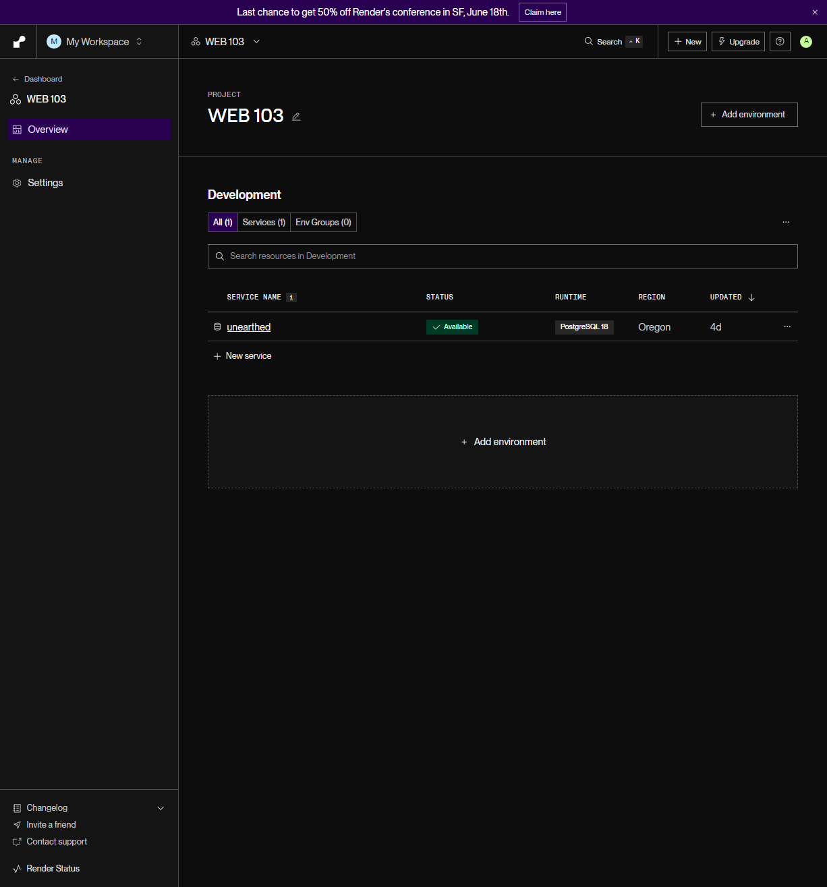

# WEB103 Project 2 - _OPM Wiki_

Submitted by: **Armin Erika Polanco**

About this web app: **OPM Wiki is a list-based web app showcasing Original Pilipino Music artists, now powered by a PostgreSQL database hosted on Render. Users can browse a curated collection of OPM artists, search and filter by name, genre, or origin, discover a random artist, and view detailed information including embedded Spotify players.**

Time spent: \*_3_ hours

## Required Features

The following **required** functionality is completed:

<!-- Make sure to check off completed functionality below -->

- [x] **The web app uses only HTML, CSS, and JavaScript without a frontend framework**
- [x] **The web app is connected to a PostgreSQL database, with an appropriately structured database table for the list items**
  - [x] **NOTE: Your walkthrough added to the README must include a view of your Render dashboard demonstrating that your Postgres database is available**
  - [x] **NOTE: Your walkthrough added to the README must include a demonstration of your table contents. Use the psql command 'SELECT \* FROM tablename;' to display your table contents.**

The following **optional** features are implemented:

- [x] The user can search for items by a specific attribute

The following **additional** features are implemented:

- [x] Artist Spotlight section on the home page that randomly features a different artist on each visit
- [x] Spotify embedded player on both the home page spotlight and individual artist detail pages
- [x] Animated card hover overlay with sliding name, genre, origin, and formation year
- [x] Entire card is clickable — no need to wait for hover animation
- [x] Search bar on the All Artists page filtering by name, genre, or origin in real time
- [x] Random Artist button that navigates to a randomly selected artist detail page
- [x] Dedicated landing page separate from the artist list page
- [x] Back to All Artists button on each artist detail page
- [x] Custom dark purple and gold grunge aesthetic built on top of Picocss
- [x] Single artist fetched via dedicated API endpoint `/artists/api/:artistId` instead of client-side filtering

## Video Walkthrough

Here's a walkthrough of implemented required features:

[Project 2 - OPM Wiki Walkthrough](https://i.imgur.com/dBl5a0l.gif)

- [https://imgur.com/a/mduaEVJ]

GIF created with ScreenToGif

## Notes

The main challenge in Unit 2 was migrating from a static JavaScript data file to a PostgreSQL database hosted on Render. One gotcha was that PostgreSQL returns column names in lowercase regardless of how they were defined, so camelCase references in the frontend (like `spotifyUrl`) had to be updated to lowercase (`spotifyurl`). The database is shared with the Unit 1 UnEarthed lab project, with the OPM Wiki artists stored in a separate `artists` table.

## License

Copyright 2026 Armin Erika Polanco

Licensed under the Apache License, Version 2.0 (the "License"); you may not use this file except in compliance with the License. You may obtain a copy of the License at

> http://www.apache.org/licenses/LICENSE-2.0

Unless required by applicable law or agreed to in writing, software distributed under the License is distributed on an "AS IS" BASIS, WITHOUT WARRANTIES OR CONDITIONS OF ANY KIND, either express or implied. See the License for the specific language governing permissions and limitations under the License.
